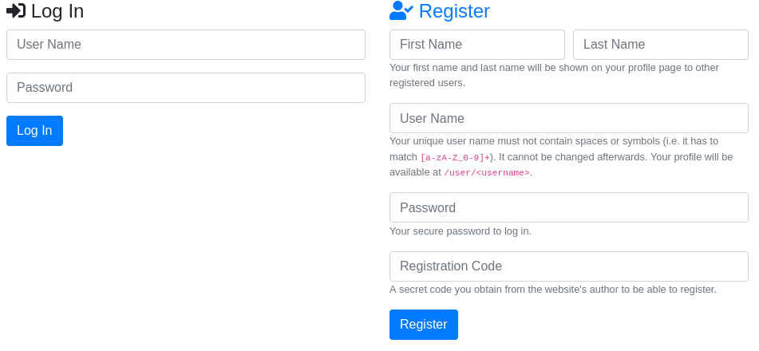
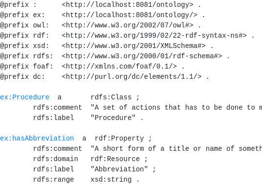
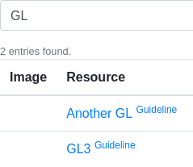
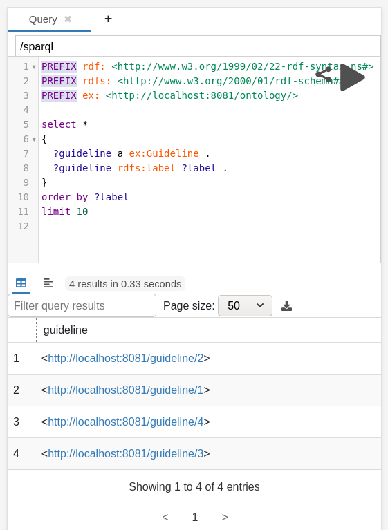
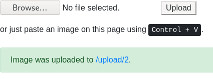
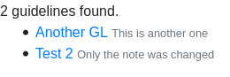
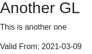
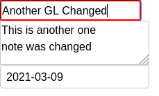

# LDAF
Linked Data Application Framework


<!-- TOC depthFrom:3 depthTo:6 withLinks:1 updateOnSave:1 orderedList:0 -->

- [Hello World](#hello-world)
	- [Settings](#settings)
	- [Application](#application)
- [First Interactions](#first-interactions)
	- [User Registration & Login](#user-registration-login)
	- [Provide the Ontology](#provide-the-ontology)
	- [Provide a Simple Search](#provide-a-simple-search)
	- [Provide a SPARQL Query Interface](#provide-a-sparql-query-interface)
	- [Provide an Image Uploader](#provide-an-image-uploader)
- [Linked Data](#linked-data)
	- [Create a Linked Data Resource](#create-a-linked-data-resource)
	- [Default CRUD](#default-crud)
	- [Link Data](#link-data)
	- [Own Linked Data Resource](#own-linked-data-resource)

<!-- /TOC -->


**Features**

* Local RDF storage using Jena TDB triplestore
* User registration and login component with JSON Web Token (JWT)
  * each user owns a private RDF graph
* Content negotiation for different groups of users:
  * `text/html` - non-technical users browsing, creating and manipulating linked data with forms
  * `application/json` - web developers not familiar with Semantic Web technologies like to use a JSON-based REST API
  * `text/turtle` - Semantic Web practitioners
* Rendering HTML with template language [FreeMarker](https://freemarker.apache.org/)
* Lightweight and comprehensible RDF to/from JSON conversion
* Intuitive JSON *object view* on RDF
* Schema-driven with ontologies (but not enforced)
* Rigorously resolvable URIs
* Extensible through `LinkedDataResource` implementations
* Image upload and serving

**Accepted Limitations**

* In JSON/RDF conversion
  * no multiple literal properties supported
  * no language tag supported
  * no literal datatype supported

## Tutorial

In this tutorial we will explain how a [exemplary](ldaf-example) linked data application is build with
LDAF.
When you would like to build your own application, we recommend you to use the [example project](ldaf-example) as
a starting point and change it like you need it.

### Hello World

First create a Java Maven project and add the LDAF dependency in your `pom.xml`.
```xml
<?xml version="1.0" encoding="UTF-8"?>
<project xmlns="http://maven.apache.org/POM/4.0.0" xmlns:xsi="http://www.w3.org/2001/XMLSchema-instance" xsi:schemaLocation="http://maven.apache.org/POM/4.0.0 http://maven.apache.org/xsd/maven-4.0.0.xsd">
    <modelVersion>4.0.0</modelVersion>
    <groupId>de.dfki.sds</groupId>
    <artifactId>example</artifactId>
    <version>1.0.0-SNAPSHOT</version>
    <packaging>jar</packaging>

    <dependencies>
        <dependency>
            <groupId>de.dfki.sds</groupId>
            <artifactId>ldaf</artifactId>
            <version>1.0.0-SNAPSHOT</version>
        </dependency>
    </dependencies>
</project>
```

Create a [Java class and a main-method](ldaf-example/src/main/java/de/dfki/sds/example/Main.java). First, we need to define the settings
of the linked data application.
```java
import de.dfki.sds.ldaf.LinkedDataApplicationSettings;

public class Main {
    public static void main(String[] args) {
        LinkedDataApplicationSettings settings = new LinkedDataApplicationSettings();
    }
}
```

#### Settings

Define the **port** where your server application will be running and several **names**:
The appname is printed in the help message (when command-line argument `-h` is used).
The prefix is the usual prefix name of your ontology.
The sitename can be accessed later during the HTML rendering.
```java
settings.setPort(8081);
settings.setPort(8081);
settings.setAppname("example.jar");
settings.setPrefix("ex");
settings.setSitename("Example");
```

Next, we state on which **host** the application will be running.
In a test environment you usually pick `localhost:port`.
The correct host is important to ensure the correct resolving of URIs in the
application, later.
```java
settings.setDefaultHost("http://localhost:8081");
```

Your linked data application needs an **ontology** that formalizes the domain of
its linked data. For demonstation purpose, we reuse our [Guideline Ontology](http://www.dfki.uni-kl.de/~mschroeder/ld/gl) and
put it in the [resources folder](ldaf-example/src/main/resources/de/dfki/sds/example/vocab) of our project.
However, we changed the namespace to `http://localhost:8081/ontology/` so that ontology concept URIs are
resolvable. In the settings, we configure an ontology supplier that returns the ontology model.
If the ontology graph URI is set with `setOntologyGraph`, the ontology model is stored in the application's [Jena TDB store](https://jena.apache.org/documentation/tdb/) as a separate RDF graph.
Aditionally, a namespace of the ontology should be provided that is used when RDF is automatically converted to JSON.
```java
String ontologyTTL = IOUtils.toString(Main.class.getResourceAsStream("/de/dfki/sds/example/vocab/gl.ttl"), "UTF-8");
Model ontology = ModelFactory.createDefaultModel().read(new StringReader(ontologyTTL), null, "TTL");
settings.setOntologySupplier(() -> ontology);
settings.setOntologyGraph(settings.getDefaultHost() + "/ontology");
settings.setOntologyNamespace(settings.getDefaultHost() + "/ontology/");
```

Some RDF graphs should be public to every registered user.
Because a user should be able to look up the ontology of your app, add the
ontology's graph URI to the public graphs.
```java
settings.getPublicGraphs().add(settings.getDefaultHost() + "/ontology");
```

Speaking of **users**, some settings have to be made.
An RDF representation is used, when a user is created in your application.
You have to specify what terminology should be used.
In our example, we utilize the [FOAF ontology](http://xmlns.com/foaf/spec/) or create
our own properties.
For the special admin user a password should be provided.
Optionally, a secret can be specified so that only users that know it can register.
When a user registers, a corresponding RDF graph is created using the user namespace and
the user's login name.
```java
settings.setUserClass(FOAF.Person);
settings.setPasswordProperty(ResourceFactory.createProperty(settings.getDefaultHost() + "/ontology/password"));
settings.setFirstNameProperty(FOAF.firstName);
settings.setLastNameProperty(FOAF.lastName);
settings.setRoleProperty(ResourceFactory.createProperty(settings.getDefaultHost() + "/ontology/role"));
settings.setLogoProperty(FOAF.depiction);
settings.setAdminPassword("a-secret");
settings.setRegisterSecret("another-secret");
settings.setUserNamespace(settings.getDefaultHost() + "/user/");
```
Similarly, when an **image** is uploaded to the server, the application assigns
a type to that resource which can be specified in the settings.
```java
settings.setUploadClass(FOAF.Image);
```

Our linked data application makes use of the template engine [Apache FreeMarker](https://freemarker.apache.org/).
**Templates** can be stored in a resource folder that has to be specified in the settings.
```java
settings.setFreemarkerTemplateClasspath("/de/dfki/sds/example/tmpl");
```

Some **paths to folders** have to be configured:
a path where the [Jena TDB](https://jena.apache.org/documentation/tdb/) is stored,
a directory where uploaded images are saved and
a folder that records the unique counted IDs.
```java
settings.setTdbPath(new File("data/tdb"));
settings.setUploadPath(new File("data/upload"));
settings.setCounterPath(new File("data/counter"));
```

#### Application

With these settings we are able to create our application.
We just need to add the default root route to the application, so that a website appears
when `/` is browsed.
```java
LinkedDataApplication lda = new LinkedDataApplication(args, settings);
lda.defaultRoot();
```

The default root route expects a `root.html` file in the template resource folder.
That is why we create the following HTML file in `example/src/main/resources/de/dfki/sds/example/tmpl/root.html`.
```html
<html>
    <head>
        <meta charset="utf-8">
        <link href="/css/bootstrap.css" rel="stylesheet" />
        <link href="/css/all.min.css" rel="stylesheet" />

        <script src="/js/jquery.min.js"></script>
        <script src="/js/bootstrap.min.js" ></script>
        <script src="/js/ldaf.js" ></script>

        <title>Hello World</title>
    </head>
    <body>
        <div class="container">
            <div class="row">
                <div class="col">
                    <h1>Hello World</h1>
                </div>
            </div>
        </div>
    </body>
</html>
```

When you start your Java program the following output is printed.
```
serverAddress: http://localhost:8081
port: 8081
```
Now, you can browse http://localhost:8081 to see the Hello World website.
[JQuery](https://jquery.com/),  [Boostrap](https://getbootstrap.com/) and [Font Awesome](https://fontawesome.com/)
are already provided by LDAF.

### First Interactions

Starting from our Hello World application, we can now interact with it.

#### User Registration & Login

Before a user can interact with our app, the person has to register first.
First, forms are needed for register (sign-up) and login (sign-in) which we place
in our `root.html` site.
```html
<div class="col-md-6">
    <h4><i class="fa fa-sign-in-alt"></i> Log In</h4>
    <form id="loginForm">
        <div class="form-group">
            <input class="form-control" type="text" placeholder="User Name" name="userName" value="${userName!''}" id="loginUserName" />
        </div>
        <div class="form-group">
            <input class="form-control" type="password" placeholder="Password" name="password" id="loginPassword" />
        </div>
        <div class="form-group">
            <button class="btn btn-primary" onclick="return loginAction()">Log In</button>
        </div>
    </form>

    <div class="alert alert-warning" role="alert" style="display: none;" id="loginFailedAlert">
        The log in failed.
    </div>

    <#if query_unauthorized??>
    <div class="alert alert-warning" role="alert">
        You have to log in first.
    </div>
    </#if>
</div>
<div class="col-md-6">
    <div id="accordion">
        <h4><a data-toggle="collapse" href="#collapseRegister"><i class="fa fa-user-check"></i> Register</a></h4>
        <div class="collapse" id="collapseRegister">
            <form id="registerForm" id="collapseRegister" class="collapse show">
                <div class="form-row">
                    <div class="col">
                        <input class="form-control" type="text" placeholder="First Name" name="firstName" />
                    </div>
                    <div class="col">
                        <input class="form-control" type="text" placeholder="Last Name" name="lastName" />
                    </div>
                </div>
                <div class="form-group">
                    <small class="text-muted">Your first name and last name will be shown on your profile page to other registered users.</small>
                </div>
                <div class="form-group">
                    <input class="form-control" type="text" placeholder="User Name" name="userName" id="regUserName"/>
                    <small class="text-muted">Your unique user name must not contain spaces or symbols (i.e. it has to match <code>[a-zA-Z_0-9]+</code>). It cannot be changed afterwards. Your profile will be available at <code>/user/&lt;username&gt;</code>.</small>
                </div>
                <div class="form-group">
                    <input class="form-control" type="password" placeholder="Password" name="password" />
                    <small class="text-muted">Your secure password to log in.</small>
                </div>
                <div class="form-group">
                    <input class="form-control" type="text" placeholder="Registration Code" name="secret" />
                    <small class="text-muted">A secret code you obtain from the website's author to be able to register.</small>
                </div>
                <div class="form-group">
                    <button class="btn btn-primary" onclick="return registerAction()">Register</button>
                </div>
            </form>

            <div class="alert alert-success" role="alert" style="display: none;" id="registerAlert">
                You are successfully registered. Sign in with your credentials.
            </div>
        </div>
    </div>
```
Note that you can use FreeMarker expressions (like `<#if`) since our HTML site is already a FreeMarker template.
The `query_*` variables can be used to access given query parameters.

Our website at http://localhost:8081/ looks like this.




LDAF already provides register and login endpoints.
We have to implement two functions to send data to them.
Fortunately, LDAF provides in [ldaf.js](ldaf/src/main/resources/de/dfki/sds/ldaf/web/js/ldaf.js) functions like `formToJSON`, `login`
and `register` to make this easy for us.
```js
function loginAction() {
    var formData = formToJSON($("#loginForm"));
    login(formData, function() {
        window.location = '/user/' + formData.userName;
    }, function() {
        $('#loginFailedAlert').show();
    });
    return false;
}

function registerAction() {
    var formData = formToJSON($("#registerForm"));
    register(formData, function() {
        $('#registerFailedAlert').hide();
        $('#registerAlert').show();
        //copy&paste username to login
        $('#loginUserName').val($('#regUserName').val());
        $('#loginPassword').val("");
        //reset input
        $('#registerForm')[0].reset();
    }, function(request) {
        $('#registerFailedAlert').text(request.responseText);
        $('#registerFailedAlert').show();
    });
    return false;
}
```

The application creates on first startup the admin user http://localhost:8081/user/admin .
```
<http://localhost:8081/user/admin>
        a       foaf:Person ;
        rdfs:label "admin" ;
        ex:role "ADMIN" ;
        ex:password "$2a$10$MOu3S18JDjMntZRv/hum0.nyRAFawBOyKCtZtv9gEw8a0nuK2oTM2" ;
        foaf:firstName "Example" ;
        foaf:lastName "Admin" .
```
We can already login as `admin` with password `a-secret` and will be redirected to
http://localhost:8081/user/admin when successful.
LDAF uses [JSON Web Tokens](https://en.wikipedia.org/wiki/JSON_Web_Token) (JWT) which is implemented with the help of
[sparkjava-jwt](https://github.com/rjozefowicz/sparkjava-jwt).
Thus, after login you should have a Http-Only JWT entry in the browser's cookie storage.

The POST request to login as admin is the following.
```
POST http://localhost:8081/auth/login
{
	"userName": "admin",
	"password": "a-secret"
}
```

#### Provide the Ontology

Just add another default route to your application in the main-method.
```java
lda.defaultOntology();
```
Additionally, add another template file `ontology.html` in the `tmpl` resource folder.
```html
<html>
    <head>
        <meta charset="utf-8">
        <link href="/css/bootstrap.css" rel="stylesheet" />
        <link href="/css/all.min.css" rel="stylesheet" />
        <script src="/js/jquery.min.js"></script>
        <script src="/js/bootstrap.min.js" ></script>
        <title>Ontology</title>
    </head>
    <body>
        <pre>${code}</pre>
    </body>
</html>
```
The FreeMarker varibale `${code}` contains the Turtle representation of the ontology.
A procedure automatically introduces links to enable browsing them.
Make sure that the ontology prefix matches the prefix in the settings.
```
@prefix ex: <http://localhost:8081/ontology/> . (in ontology)
settings.setPrefix("ex"); (in Java)
```
Since the ontology namespace is identical with the namespace in the ontology file,
every concept URI is resolvable.
Currently, this only works when a path (`/`) is used, instead of a fragment identifier `#`.




Providing the ontology in Turtle syntax is still not easy to understand for
non-technical users. Using the template language and the ontology model one
could provide a better visualization.

Browsing the ontology in HTML is nice for users, but not well for machines.
The default ontology route also allows to retrieve JSON and RDF via [content negotiation](https://en.wikipedia.org/wiki/Content_negotiation).
By using a REST client (like [insomnia](https://insomnia.rest/)), you can send different `Accept` headers (`application/json` or `text/turtle`) to the same ontology URL.
Note that when you are not signed-in, you will get a `401 Unauthorized` HTTP status code.
Thus, first log in with a POST request.
```
POST http://localhost:8081/auth/login
{
	"userName": "admin",
	"password": "a-secret"
}
```
**JSON**
```
GET http://localhost:8081/ontology (Accept: application/json)

Response ===============================================
{
  "ontology": [
    {
      "uri": "http://localhost:8081/ontology/worksAt",
      "path": "/ontology/worksAt",
      "localname": "worksAt",
      "label": "Works At",
      "comment": "A person works at a certain department or in a certain group.",
      "domain": [
        {
(...)
```
Note that this is *not* [JSON-LD](https://en.wikipedia.org/wiki/JSON-LD).

**RDF**
```
GET http://localhost:8081/ontology (Accept: text/turtle)

Response ===============================================
@prefix :      <http://localhost:8081/ontology> .
@prefix ex:    <http://localhost:8081/ontology/> .
@prefix owl:   <http://www.w3.org/2002/07/owl#> .
@prefix rdf:   <http://www.w3.org/1999/02/22-rdf-syntax-ns#> .
@prefix xsd:   <http://www.w3.org/2001/XMLSchema#> .
@prefix rdfs:  <http://www.w3.org/2000/01/rdf-schema#> .
@prefix foaf:  <http://xmlns.com/foaf/0.1/> .
@prefix dc:    <http://purl.org/dc/elements/1.1/> .

ex:Procedure  a       rdfs:Class ;
        rdfs:comment  "A set of actions that has to be done to manage a guideline." ;
        rdfs:label    "Procedure" .
(...)
```

#### Provide a Simple Search

This resource provides a simple RegEx-based search on labels of resources.
Write this code snippet in the main-method to add it to the application.
```java
lda.defaultSearch();
```

For the HTML-case, you should create a `search.html` template like the following.
```html
<form>
    <input class="form-control" name="q" value="${query!''}" placeholder="Search"/>
</form>

<#if result??>
<small class="text-muted">${result?size} entries found.</small><br/>

<table class="table">
    <thead>
        <tr>
            <th>Image</th>
            <th>Resource</th>
        </tr>
    </thead>
    <tbody>
        <#list result as entry>
        <tr>
            <td width="1%" style="text-align: center;">
                <a href="${entry.path}">
                    <#if entry.resource.depiction??>
                    
                    </#if>
                </a>
            </td>
            <td><a href="${entry.path}">${entry.label} <sup>${(entry.resource.type[0].label)!''}</sup></a></td>
        </tr>
        </#list>
    </tbody>
</table>
</#if>
```
The `${query}` variable holds the current query.
If a non-empty query was sent via the `q` query parameter, a result is returned that can be iterated with `<#list`.
A rendered version with data looks like this:




It also handles `Accept:application/json` and `Accept:text/turtle` requests.

**JSON**
```
GET http://localhost:8081/search?q=works (Accept: application/json)

Response ===============================================
{
  "query": "works",
  "result": [
    {
      "path": "/ontology/worksAt",
      "label": "Works At",
      "uri": "http://localhost:8081/ontology/worksAt",
      "graph": "http://localhost:8081/ontology",
      "resource": {
        "uri": "http://localhost:8081/ontology/worksAt",
        "path": "/ontology/worksAt",
        "localname": "worksAt",
(...)
```

#### Provide a SPARQL Query Interface

Having a search interface that looks up resources based on their labels is nice,
but Semantic Web practitioners usually would like to use a powerful SPARQL query interface.
Activate the default SPARQL resource provided by LDAF with this code snippet in the main-method.
```java
lda.defaultSparql();
```
Our component uses the `getUnionOfVisibleModels` method from the `LinkedDataResource`
class to only let the user search in the graphs that are visible for this person.
This includes all public graphs (see settings), the user's graph and the ontology graph.

We can utilize [YASGUI](https://triply.cc/docs/yasgui) (Yet Another Sparql GUI)
to provide a SPARQL user interface.
```html
<div id="yasgui"></div>
<script>
    const defaultQuery =
            "PREFIX rdf: <http://www.w3.org/1999/02/22-rdf-syntax-ns#>\n" +
            "PREFIX rdfs: <http://www.w3.org/2000/01/rdf-schema#>\n" +
            "PREFIX ex: <http://localhost:8081/ontology/>\n" +
            "\n" +
            "select *\n" +
            "{\n" +
            "  ?guideline a ex:Guideline .\n" +
            "  ?guideline rdfs:label ?label .\n" +
            "}\n" +
            "order by ?label\n" +
            "limit 10\n";

    Yasgui.Yasqe.defaults['value'] = defaultQuery;
    Yasgui.Yasr.defaults.prefixes['ex'] = 'http://localhost:8081/ontology/';

    const yasgui = new Yasgui(document.getElementById("yasgui"), {
        requestConfig: {
            endpoint: "/sparql"
        },
        copyEndpointOnNewTab: true,
        autofocus: true,
        endpointCatalogueOptions: {
            getData: () => {
                return [
                    {
                        endpoint: "/sparql"
                    }
                ];
            }
        }
    });
</script>
```
Do not forget to add the following sources to the header.
```html
<link href="/css/yasgui.min.css" rel="stylesheet" />
<script src="/js/yasgui.min.js" ></script>
```

This gives us the following website at http://localhost:8081/sparql .



Since the queried URIs are resolvable by our application, the returned resource links can be browsed
by the user.

#### Provide an Image Uploader

Images are usually used to depict things, for example, users having avatars.
Linked data easily allows you to refer to images in the web.
However, it can happen that after some time such images may not be accessable anymore.
This is why we would like to host the images in our application.

Add the default uploader with the following code snippet in the main-method.
We also have to state the RDF graph URI where the meta data of uploaded data will be stored.
```java
settings.setUploadStorage(req -> lda.getDatasetStorage().getGraph(settings.getDefaultHost() + "/imageGraph"));
lda.defaultUploader();
```
Additionally, add the following HTML site `upload.html` in the template folder.
```html
<form method='post' enctype='multipart/form-data'>
    <input type='file' name='uploaded_file'>
    <button>Upload</button>
</form>
or just paste an image on this page using <kbd>Control + V</kbd>.

<script>
    document.onpaste = function (event) {
        var items = (event.clipboardData || event.originalEvent.clipboardData).items;
        for (index in items) {
            var item = items[index];
            if (item.kind === 'file') {
                var blob = item.getAsFile();

                var fd = new FormData();
                fd.append('uploaded_file', blob);

                $('#uploadingAlert').show();

                $.ajax({
                    type: 'POST',
                    url: '/upload',
                    data: fd,
                    headers: {
                        Accept: "application/json"
                    },
                    processData: false,
                    contentType: false,
                    success: function (data, textStatus, request) {
                        var link = request.getResponseHeader('Location');
                        $('#linkAnchor').attr("href", link);
                        $('#linkAnchor').text(link);
                        $('#uploadingAlert').hide();
                        $('#uploadAlert').show();
                    }
                });
            }
        }
    }
</script>

<br/>
<br/>

<#if link??>
<div class="alert alert-success" role="alert">
    Image was uploaded to <a href="${link}">${link}</a>.
</div>
</#if>

<div class="alert alert-success" role="alert" style="display: none" id="uploadAlert">
    Image was uploaded to <a href="" id="linkAnchor"></a>.
</div>

<div class="alert alert-info" role="alert" style="display: none" id="uploadingAlert">
    Image is uploading ...
</div>
```
The uploader receives a file via a `POST` request containing a `uploaded_file` file object.
On success, it returns the uploaded image's URL in `Location` header, for example, `http://localhost:8081/upload/15`.
These links can be used to refer to uploaded images in our linked data.




Because of missing transparency in JPG images, we also create a corresponding PNG version.
By appending `.jpg` or `.png` to the upload link, the retrieved format can be selected.
For storage capacity reasons, images are resized if one of their highest dimension is over 600 pixels.
Other than images, our uploader implementation also supports PDF (\*.pdf) files.

### Linked Data

For now, users can register and login to your application, they can look at the ontology,
search resources and upload images.
It is time that they are able to **C**reate, **R**ead, **U**pdate and **D**elete (CRUD) resources.

#### Create a Linked Data Resource

You do not have to use the default resources from LDAF.
Instead, make your own one by extending the `LinkedDataResource` class.
In our example project, we would like to allow users to manage guidelines.
This is how an empty linked data resource looks like.
```java
public class GuidelineResource extends LinkedDataResource {
    @Override
    public void init() {

    }
}
```


In our linked data application we have to register this resource by writing
the following code in the main-method.
```java
lda.initResource(GuidelineResource.class);
```

#### Default CRUD

CRUD is often implemented very similar.
This is why LDAF provides a default implementation for it that takes you a one-liner.
We extend our code above with the following line.
```java
public class GuidelineResource extends LinkedDataResource {
    @Override
    public void init() {
        this.defaultRoutes("guideline", req -> getUserGraph(req), GL.Guideline);
    }
}
```
The first argument decides how the resource is named and how resource URIs are formed, for instance, in our case
`http://localhost:8081/guideline`.
The second argument tells our method in which RDF graph the linked data is stored and retrieved.
For now we would like that users manage guideline meta data in their own graphs.
The last argument specifies the RDF type of the resources, that is `http://localhost:8081/ontology/Guideline`.

HTML Templates names following a convention for the *Read* `GET` case:
`<resourcename>list.html` for list view and `<resourcename>.html` for single resource view.

**Read Resource List**

First, we check that initially there are no guidelines in the user's graph.
```json
GET http://localhost:8081/guideline (Accept: application/json)

Response ===============================================
{
  "total": 0,
  "shown": 0,
  "offset": 0,
  "limit": 16,
  "page": 1,
  "pages": [
    {
      "number": 1,
      "path": "/guideline?offset=0",
      "active": true
    }
  ],
  "first": "/guideline",
  "list": []
}
```
Our default implementation supports pagination and returns helpful numbers.
Note that a page contains at maximum 16 entries by default.
However, this can be changed per request with a query parameter, e.g.
`http://localhost:8081/guideline?limit=20`.
The resources are returned in descending order of their URIs, hence,
recently added resources will be listed first.

A user interface for non-technical users can be provided with an HTML page
named `guidelinelist.html`. Intuitively, you can use all values that are
presented in the JSON result.
With the template language the page can be freely structured and designed.
```html
${total} guideline${(total == 1)?then('','s')} found.

<ul>
<#list list as guideline>
<li>
    <a href="${guideline.path}">${guideline.hasTitle}</a>
    <small class="text-muted">${guideline.hasNote!''}</small>
</li>
</#list>
</ul>
```

After we created two guidelines (see below), they are listed in the HTML page.




The corresponding JSON result is the following.
```json
{
  "total": 2,
  "shown": 2,
  "offset": 0,
  "limit": 16,
  "page": 1,
  "pages": [
    {
      "number": 1,
      "path": "/guideline?offset=0",
      "active": true
    }
  ],
  "first": "/guideline",
  "list": [
    {
      "uri": "http://localhost:8081/guideline/2",
      "path": "/guideline/2",
      "localname": "2",
      "label": "Another GL",
      "hasNote": "This is another one",
      "hasTitle": "Another GL",
      "validFrom": "2021-03-09",
      "type": [(...)],
      "_incoming": {}
    },
    {
      "uri": "http://localhost:8081/guideline/1",
      "path": "/guideline/1",
      "localname": "1",
      "label": "Test 2",
      "hasNote": "Only the note was changed",
      "hasTitle": "Test 2",
      "validFrom": "2021-03-01",
      "type": [(...)],
      "_incoming": {}
    }
  ]
}
```

**Read Single Resource**

After some guidelines were created, you can browse them individually.

```json
GET http://localhost:8081/guideline/2 (Accept: application/json)

Response ===============================================
{
  "uri": "http://localhost:8081/guideline/2",
  "path": "/guideline/2",
  "localname": "2",
  "label": "Another GL",
  "hasNote": "This is another one",
  "hasTitle": "Another GL",
  "validFrom": "2021-03-09",
  "type": [(...)],
  "_incoming": {}
}
```

```
GET http://localhost:8081/guideline/2 (Accept: text/turtle)

Response ===============================================
@prefix ex:    <http://localhost:8081/ontology/> .
@prefix owl:   <http://www.w3.org/2002/07/owl#> .
@prefix rdf:   <http://www.w3.org/1999/02/22-rdf-syntax-ns#> .
@prefix xsd:   <http://www.w3.org/2001/XMLSchema#> .
@prefix rdfs:  <http://www.w3.org/2000/01/rdf-schema#> .
@prefix dc:    <http://purl.org/dc/elements/1.1/> .

<http://localhost:8081/guideline/2>
        a             ex:Guideline ;
        rdfs:label    "Another GL" ;
        ex:hasNote    "This is another one" ;
        ex:hasTitle   "Another GL" ;
        ex:validFrom  "2021-03-09" .
```

To have a user interface, we should create a `guideline.html` template.
```html
<h2>${hasTitle}</h2>
<p>
    ${hasNote!''}
</p>
<#if validFrom??>
Valid from: ${validFrom}
</#if>
```




**Create**

We create our first guideline by sending a POST request.
```
POST http://localhost:8081/guideline
{
    "label": "Test",
    "hasTitle": "Test",
    "hasNote": "A note",
    "validFrom": "2021-03-08"
}

Response Header ----------------------------------------
Location: /guideline/1
```
Note that we just use the localnames of the properties of our ontology, because
they are autocompleted when the JSON is converted to RDF.
`label` and `comment` will always be recognized as RDFS vocabulary.
To be lightweight we forego datatypes, for example, for the `validFrom` date.
Since we count up the ID numbers for each resource type, the Guideline with URI
`http://localhost:8081/guideline/1` stays unique.

```
GET http://localhost:8081/guideline/1 (Accept: text/turtle)

Response ===============================================
@prefix ex:    <http://localhost:8081/ontology/> .
@prefix rdfs:  <http://www.w3.org/2000/01/rdf-schema#> .

<http://localhost:8081/guideline/1>
        a             ex:Guideline ;
        rdfs:label    "Test" ;
        ex:hasNote    "A note" ;
        ex:hasTitle   "Test" ;
        ex:validFrom  "2021-03-08" .
```
```
GET http://localhost:8081/guideline/1 (Accept: application/json)

Response ===============================================
{
  "uri": "http://localhost:8081/guideline/1",
  "path": "/guideline/1",
  "localname": "1",
  "label": "Test",
  "hasNote": "A note",
  "hasTitle": "Test",
  "validFrom": "2021-03-08",
  "type": [
    {
      "uri": "http://localhost:8081/ontology/Guideline",
      "path": "/ontology/Guideline",
      "localname": "Guideline",
      "label": "Guideline",
      "comment": "A guideline is a document that contains statements used to determine a course of action. It aims to streamline particular processes according to a set routine or sound practice.",
      "subClassOf": [
        {
          "uri": "http://xmlns.com/foaf/0.1/Document",
          "path": "/foaf/0.1/Document",
          "localname": "Document"
        }
      ],
      "type": [
        {
          "uri": "http://www.w3.org/2000/01/rdf-schema#Class",
          "path": "/2000/01/rdf-schema",
          "localname": "rdf-schema#Class"
        }
      ]
    }
  ],
  "_incoming": {}
}
```
Since RDF is a graph and JSON an object tree, a recursive depth traversal is used to
form the JSON document from the graph nodes.
By default, the depth is set to 1 which means that the root resource and its children are fully modelled in JSON.
Once the depth is below zero, no outgoing edges are considered, thus the JSON document is not further extended.
Every referenced resource has at least its `uri`, `path` (only path component of URI) and `localname` (last segment of path or fragment identifier),
label and comment if available.
The depth parameter can be forwarded with a query parameter.
```
GET http://localhost:8081/guideline/1?depth=0 (Accept: application/json)

Response ===============================================
{
  "uri": "http://localhost:8081/guideline/1",
  "path": "/guideline/1",
  "localname": "1",
  "label": "Test",
  "hasNote": "A note",
  "hasTitle": "Test",
  "validFrom": "2021-03-08",
  "type": [
    {
      "uri": "http://localhost:8081/ontology/Guideline",
      "path": "/ontology/Guideline",
      "localname": "Guideline",
      "label": "Guideline",
      "comment": "A guideline is a document that contains statements used to determine a course of action. It aims to streamline particular processes according to a set routine or sound practice."
    }
  ]
}
```

In our user interface we can provide AJAX calls for our non-technical users.
Thus, we put the following code snippet in our `guidelinelist.html` file.
```html
<input type="text" placeholder="title" id="title" />
<button class="btn btn-primary" onclick="createGuideline()">Create</button>
<script>
function createGuideline() {
    var title = $("#title").val();
    $.ajax({
        type: "POST",
        url: "/guideline",
        data: JSON.stringify({label: title, hasTitle: title}),
        dataType: "text",
        contentType: "application/json",
        success: function (data, textStatus, request) {
            window.location = request.getResponseHeader('Location');
        }
    });
}
</script>
```
After the guideline is successfully created, we redirect the user to it.

**Update**

We have two possibilities to update a resource: overwriting it completely (PUT) or changing some
selected properties (PATCH).

```
PUT http://localhost:8081/guideline/1
{
    "label": "Test 2",
    "hasTitle": "Test 2",
    "hasNote": "Another note",
    "validFrom": "2021-03-01",
	"type": ["/ontology/Guideline"]
}
```
Note that we also have to state the type because all outgoing edges are removed before
the new property values are added.
When referring to a resource (like the RDFS class *Guideline*), you have to use a JSON Array.
Also note that it is sufficient that you state only the path (not the full URI) to a resource when it is
managed by your application.

```
PATCH http://localhost:8081/guideline/1
{
    "hasNote": "Only the note was changed"
}
```
When patching, all other properties not mentioned are not effected.

In the user interface we could make a special edit page for guidlines right in
the `guideline.html` template.
By using FreeMarkers `#if` statement, we can switch to an edit mode when the query parameter
`edit` is passed, e.g. http://localhost:8081/guideline/2?edit .
```html
<#if query_edit??>
    <input type="text" value="${hasTitle}" placeholder="Title" id="hasTitleId" /><br/>
    <textarea placeholder="Note" id="hasNoteId">${hasNote!''}</textarea><br/>
    <input type="text" value="${validFrom!''}" placeholder="Valid From" id="validFromId"/>

    <script>
        propertyPatcher("hasTitleId", "hasTitle");
        propertyPatcher("hasTitleId", "label");
        propertyPatcher("hasNoteId", "hasNote");
        propertyPatcher("validFromId", "validFrom");
    </script>
<#else>
    <h2>${hasTitle}</h2>
    <p>
        ${hasNote!''}
    </p>

    <#if validFrom??>
    Valid from: ${validFrom}
    </#if>
</#if>
```
Our [ldaf.js](ldaf/src/main/resources/de/dfki/sds/ldaf/web/js/ldaf.js) file provides the `propertyPatcher` function.
It implements for an `input` (or `textarea`) element a debounce mechanism: when the user
stops typing, a PATCH request is sent that changes the given property value of the currently
browsed site (in our case http://localhost:8081/guideline/2).
A red border around the element indicates that entered value was not yet changed on the server side.




A similar behavior is implemented in `patchSelectOnChange` for `select` elements.

**Delete**

Delete removes all outgoing and incoming edges of the resource.
Hence, it does not exist anymore.
```
DELETE http://localhost:8081/guideline/1
```

On our `guideline.html` page, we can provide a delete button that sends an AJAX call.
If it was successful, we redirect the user back to the list of guidelines.
```html
<button class="btn btn-danger" onclick="del('${label}', '${path}')">Delete</button>
<script>
    function del(label, path) {
        if (confirm("Remove "+ label +"?")) {
            $.ajax({
                type: "DELETE",
                url: path,
                success: function () {
                    window.location.replace("/guideline");
                }
            });
        }
    }
</script>
```

We can also delete all guidelines at once.
```
DELETE http://localhost:8081/guideline
```

#### Link Data

Our guideline resources can be linked to other resources, for example,
uploaded images could be attached to guidelines to give them a depiction.
```
PATCH http://localhost:8081/guideline/1
{
    "depiction": ["/upload/2"]
}
```
Although, there is no http://localhost:8081/ontology/depiction property defined, we
can use it ad-hoc to link a previously uploaded image to http://localhost:8081/guideline/1 .
Schema validation is currently not supported, but could be implemented in later versions.

The JSON converter detects valid URIs and link them correctly.
```
PATCH http://localhost:8081/guideline/1
{
    "wikipedia": ["https://en.wikipedia.org/wiki/Medical_guideline"],
    "file": ["file:///home/user/GL/01.pdf"]
}
```

Certainly, we can also link resources among each other.
```
PATCH http://localhost:8081/guideline/1
{
    "predecessor": [ "/guideline/2", "/guideline/3"]
}
```

After those changes our http://localhost:8081/guideline/1 resource is linked the
following way.
```
GET http://localhost:8081/guideline/1 (Accept: text/turtle)

Response ===============================================
@prefix ex:    <http://localhost:8081/ontology/> .
@prefix rdfs:  <http://www.w3.org/2000/01/rdf-schema#> .

<http://localhost:8081/guideline/1>
        a               ex:Guideline ;
        rdfs:label      "Test 2" ;
        ex:depiction    <http://localhost:8081/upload/2> ;
        ex:file         <file:///home/user/GL/01.pdf> ;
        ex:hasNote      "Only the note was changed" ;
        ex:hasTitle     "Test 2" ;
        ex:predecessor  <http://localhost:8081/guideline/2> , <http://localhost:8081/guideline/3> ;
        ex:validFrom    "2021-03-01" ;
        ex:wikipedia    <https://en.wikipedia.org/wiki/Medical_guideline> .
```

The JSON document of http://localhost:8081/guideline/1 - a *resource fragment* is recursively
constructed with its adjacent resources.
These adjacent resources are expanded to a certain extend to learn more about their properties.
Such JSON object makes it easier to visualize it properly.
```json
GET http://localhost:8081/guideline/1 (Accept: application/json)

Response ===============================================
{
  "uri": "http://localhost:8081/guideline/1",
  "path": "/guideline/1",
  "localname": "1",
  "label": "Test 2",
  "hasNote": "Only the note was changed",
  "hasTitle": "Test 2",
  "validFrom": "2021-03-01",
  "depiction": [
    {
      "uri": "http://localhost:8081/upload/2",
      "path": "/upload/2",
      "localname": "2",
      "type": [
        {
          "uri": "http://xmlns.com/foaf/0.1/Image",
          "path": "/foaf/0.1/Image",
          "localname": "Image"
        }
      ]
    }
  ],
  "file": [
    {
      "uri": "file:///home/user/GL/01.pdf",
      "path": "/home/user/GL/01.pdf",
      "localname": "01.pdf"
    }
  ],
  "predecessor": [
    {
      "uri": "http://localhost:8081/guideline/2",
      "path": "/guideline/2",
      "localname": "2",
      "label": "Another GL Changed",
      "hasNote": "This is another one\nnote was changed",
      "hasTitle": "Another GL Changed",
      "validFrom": "2021-03-09",
      "type": [
        {
          "uri": "http://localhost:8081/ontology/Guideline",
          "path": "/ontology/Guideline",
          "localname": "Guideline",
          "label": "Guideline",
          "comment": "A guideline is a document that contains statements used to determine a course of action. It aims to streamline particular processes according to a set routine or sound practice."
        }
      ]
    },
    {
      "uri": "http://localhost:8081/guideline/3",
      "path": "/guideline/3",
      "localname": "3",
      "label": "the third one",
      "hasTitle": "the third one",
      "type": [(...)]
    }
  ],
  "type": [(...)],
  "wikipedia": [
    {
      "uri": "https://en.wikipedia.org/wiki/Medical_guideline",
      "path": "/wiki/Medical_guideline",
      "localname": "Medical_guideline"
    }
  ],
  "_incoming": {}
}
```

**Incoming Edges**

Since we talk about linked data, it is usual that incoming edges exist when a directed
edge is made.
In our example, http://localhost:8081/guideline/2 has now an incoming edges originating
from http://localhost:8081/guideline/1 .
To model this fact in JSON, we provide a special `_incoming` JSON object:
its keys are incoming properties.
This way, we can access information about resources that refer to a certain resource.
```json
GET http://localhost:8081/guideline/2 (Accept: application/json)

Response ===============================================
{
  "uri": "http://localhost:8081/guideline/2",
  "path": "/guideline/2",
  "localname": "2",
  "label": "Another GL Changed",
  "hasNote": "This is another one\nnote was changed",
  "hasTitle": "Another GL Changed",
  "validFrom": "2021-03-09",
  "type": [(...)],
  "_incoming": {
    "predecessor": [
      {
        "uri": "http://localhost:8081/guideline/1",
        "path": "/guideline/1",
        "localname": "1",
        "label": "Test 2",
        "hasNote": "Only the note was changed",
        "hasTitle": "Test 2",
        "validFrom": "2021-03-01",
        "depiction": [
          {
            "uri": "http://localhost:8081/upload/2",
            "path": "/upload/2",
            "localname": "2"
          }
        ],
        "file": [
          {
            "uri": "file:///home/user/GL/01.pdf",
            "path": "/home/user/GL/01.pdf",
            "localname": "01.pdf"
          }
        ],
        "predecessor": [
          {
            "uri": "http://localhost:8081/guideline/2",
            "path": "/guideline/2",
            "localname": "2",
            "label": "Another GL Changed"
          },
          {
            "uri": "http://localhost:8081/guideline/3",
            "path": "/guideline/3",
            "localname": "3",
            "label": "the third one"
          }
        ],
        "type": [(...)],
        "wikipedia": [
          {
            "uri": "https://en.wikipedia.org/wiki/Medical_guideline",
            "path": "/wiki/Medical_guideline",
            "localname": "Medical_guideline"
          }
        ]
      }
    ]
  }
}
```

**Enforce Ordering**

Usually, in RDF graphs property edges are unordered.
If the order of referenced RDF nodes should be preserved, an RDF List can be used.
An RDF List can be enforced by using the `:list` postfix in a property name.
This way, the array will always be ordered in the way it was provided.
```
PATCH http://localhost:8081/guideline/1
{
    "includes:list": ["/guideline/4", "/guideline/2"]
}
```
This PATCH leads to the following RDF in Turtle syntax.
```
<http://localhost:8081/guideline/1>
    ex:includes ( <http://localhost:8081/guideline/4> <http://localhost:8081/guideline/2> ) .
```

#### Own Linked Data Resource

When you do not need the default CRUD behavior,
you may would like to create your own linked data resource.
Because we use the [Spark](http://sparkjava.com/) framework,
you can define your own routes.
LDAF provides in `LinkedDataResource` a method called `response` that makes
it easy for you to provide the right format for a certain Accept header (HTML, JSON or RDF).
You should making efforts to provide all of them, so that (a) non-technical user get a
rendered visualization of your resource in a web browser, (b) web developer can query the resource
with a REST call and receive JSON and (c) Semantic Web practioners can consume RDF directly.
Make sure that the information content is the same for each format.
```java
public class OwnResource extends LinkedDataResource {
    @Override
    public void init() {
        Spark.get("/own", this::ownRoute);
    }

    private Object ownRoute(Request req, Response resp) {
        return response(req, resp,
                renderModel -> {

                    return "own.html";
                },
                json -> {

                },
                model -> {

                }
        );
    }
}
```
Do not forget to initalize the resource in the application.
```java
lda.initResource(OwnResource.class);
```

**Provide HTML**

To provide HTML, you fill a render model with values that can be used in the FreeMarker template.
You can also pass Java Beans (POJOs), just check the [FreeMarker documentation](https://freemarker.apache.org/docs/index.html) to see what this
template language is capable of.
Return the name of the template file (that is stored in the template folder, see settings) that should
be used for rendering.
```java
renderModel -> {
    renderModel.put("Var", 5);
    return "own.html";
},
```

The `own.html` file looks like the following.
```html
<div class="container">
    My Own Resource<br/>

    Var: ${Var}
</div>
```


If you already have a JSON object you would like to render in the template, you can use the
`prepareRenderModel` method in the following way.
This will make the JSON object's data available in the template.
```java
JSONObject obj = new JSONObject();
obj.put("Var", 5);
//(...)
renderModel -> {
    prepareRenderModel(renderModel, obj, req);
    return "own.html";
},
```

**Provide JSON**

To provide JSON, you fill the given `json` in the lambda function with content.
If you already have formed a JSON object, you can use the `copy` method that copys a
source JSON object to a target (copys all keys).

```java
json -> {
    json.put("Var", 5);
    copy(obj, json);
},
```

```json
GET http://localhost:8081/own (Accept: application/json)

Response ===============================================
{
  "Var": 5
}
```

**Provide RDF**

To provide RDF, just add statements to the given `model` argument in the
lambda function.
You may would like to use the `ontologyAddress` method to create an ad-hoc property or
`resource` method to get the URI of the current resource, namely http://localhost:8081/own .
```java
model -> {
    Property p = ResourceFactory.createProperty(ontologyAddress("var"));
    model.addLiteral(resource(req), p, 5);
}
```
This leads to the following result.
```
GET http://localhost:8081/own (Accept: text/turtle)

Response ===============================================
<http://localhost:8081/own>
    <http://localhost:8081/ontology/var>
        "5"^^<http://www.w3.org/2001/XMLSchema#int> .
```

**Use the Converter**

Usually, your linked data application stores already RDF data.
Your resource could provide parts of some RDF graph.
Thus, you can first access a graph in our TDB store.
This can also be the graph of the user who is requesting.
```java
RDFGraphStorage graph = datasetStorage.getGraph("graph:uri");
RDFGraphStorage userGraph = getUserGraph(req);
```

You can use an SPARQL construct query to select specific statements from
the RDF graph, for instance, guidelines that have a valid date before today.
```java
Model subgraph =
userGraph.calculateRead(() -> {
    QueryExecution qe = QueryExecutionFactory.create(
            "PREFIX ex: <"+ ldaf.getSettings().getOntologyNamespace() +">\n" +
            "PREFIX xsd: <"+ XSD.NS +">\n" +
            "CONSTRUCT { ?gl ?p ?o } WHERE { ?gl a ex:Guideline ; ex:validFrom ?validFrom ; ?p ?o . FILTER(xsd:date(?validFrom) < xsd:date(NOW())) }",
            userGraph.getModel()
    );
    return ModelFactory.createDefaultModel().add(qe.execConstruct());
});
```

In `LinkedDataResource` you have access to the `converter` that is able to
convert RDF to JSON.
```java
JSONArray guidelines = converter.toJSON(subgraph);
JSONObject result = new JSONObject();
result.put("guidelines", guidelines);
```
Note that the converter can also be used to convert one resource.
```java
JSONObject toJSON(Resource subject, Model model);
//or
JSONObject toJSON(Resource subject, Model model, int depth);
```
And it provides the other direction from JSON to RDF.
```java
Model toModel(String subjectURI, JSONObject json);
```

This way, we can provide the same information originating from RDF in different formats.
```java
return response(req, resp,
    renderModel -> {
        prepareRenderModel(renderModel, result, req);
        return "another.html";
    },
    json -> {
        copy(result, json);
    },
    model -> {
        model.add(subgraph);
    }
);
```

**SPARQL Queries**

Use in your `LinkedDataResource` the following method to load a SPARQL query from resources.
```java
ParameterizedSparqlString getQuery(String sparqlResource)
```
The resource path `de.dfki.sds.ldaf.sparql` is searched for a sparql query file.
Standard prefixes and the prefix of the application's ontology is automatically provided.
This way you can write and save at `src/main/resources/de/dfki/sds/ldaf/sparql` your own SPARQL queries.

Additionally, we provide `query` methods to make it easy to execute SPARQL queries.
```java
List<QuerySolution> query(ParameterizedSparqlString pss);
<T> T query(ParameterizedSparqlString pss, Function<ResultSet, T> f);
```
